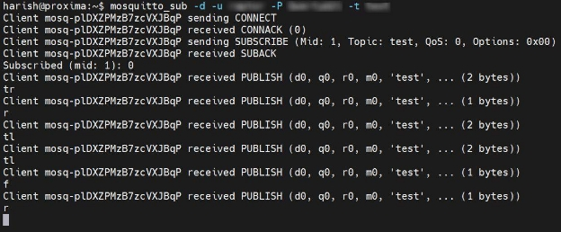

**Raptor V3 Proposal**

Submitted by : Harish  Ashok

\-------------------------------------------------------------------------------------------------

**Aim:**

To create an advanced rover with global control capability and if possible a level 3 autonomous system with a 70 fps live camera stream.

**Materials required:**

- Raspberry Pi (model 4 recommend)
- A Linux server
- L298N Motor Driver
- < 7v Battery
- A chassis (with motors and wheels)
- A power bank
- A Raspberry Pi camera
- Robotics tools
- Basic Components

**Explanation:**

This is a project with the intention of a car being able to be controlled anywhere around the world with the internet.

I have previously developed the car as Raptor V1 and V2. This V3 is going to include some upgrades to its computer as it previously used esp8266 in the V1 and V2, This version is going to be using the Raspberry Pi 4 as its computer. This gives us the advantage for additional features such as stream video footage at 70 fps, a level 3 autonomous system, etc. But it also comes at the cost to include a power bank for the Raspberry Pi.

The Raptor cars use a protocol called MQTT (MQ Telemetry Transport), this protocol allows us to command the car over the internet using port 1883. This requires some advanced programming with networking. I have made a working prototype (fig 1.1) of the Raptor V3 for testing.

Fig 1.1 Raptor Body

The prototype uses a Raspberry Pi same as V3 (Fig 1.2), and L298N as its motor driver (Fig 1.3), a recycled 7v battery for L298N power (Fig 1.4). The chassis is recycled from headset box cardboard and the plastic base from Raptor V1.

 

Fig 1.2 Raspberry Pi 4                                Fig 1.3 L298N Motor Driver

Fig 1.4 7V Battery

The car also requires a server, here in my case I used my home lab servers (Fig 1.5). The server runs the MQTT server-end software (Fig 1.6).

Fig 1.5 Linux Server

Fig 1.6 Server Back-end

I have also programmed an app to control the car (Fig 1.7 & Fig 1.8). The car requires two programs one being the program for Raptor itself (Fig 1.9) and the other to control the car (Fig 1.7 & Fig 1.8) its all done using Python.

Fig 1.7 Raptor Control App

Fig 1.8 Raptor Control App Program

Fig 1.9 Raptor Raspberry Pi 4 Program Running in Raspbian Buster Linux

As this is the prototype I am powering the raspberry pi directly from power outlets instead of a power bank. Later when I create the final V3 Raptor I will hopefully include a power bank, Pi camera and a level 3 autonomous system.

The car works when a command is given by the user in any place around the world. First, the command reaches the server later the command is shortened (Fig.1.6) and forwarded by the server to the car using the MQTT protocol (Fig 1.9) The car interprets the command and commands the motor driver to move in the direction the user requested. As the server, car and user are connected to the internet they can be controlled anywhere around the world. I have successfully tested global control by connecting my laptop to mobile data via hotspot, the prototype to a data dongle and my server to my home lab network. Even though the three devices were in different networks they performed really well with low latency. Fig 1.10 describes the Raptor API.

Fig 1.10 Raptor API

**Application:**

The Raptor can be used for unmanned expeditions to dangerous places and can also purpose as a universal research rover as it never runs out of range until there is the internet. The car is so versatile since it has a Raspberry Pi many upgrades could be added like live video streaming, level 3 autonomous system, obstacle avoidance system, etc. The Raptor API can not only be a car it can also be any mechanical object that includes robotic dogs and all-terrain vehicles.
